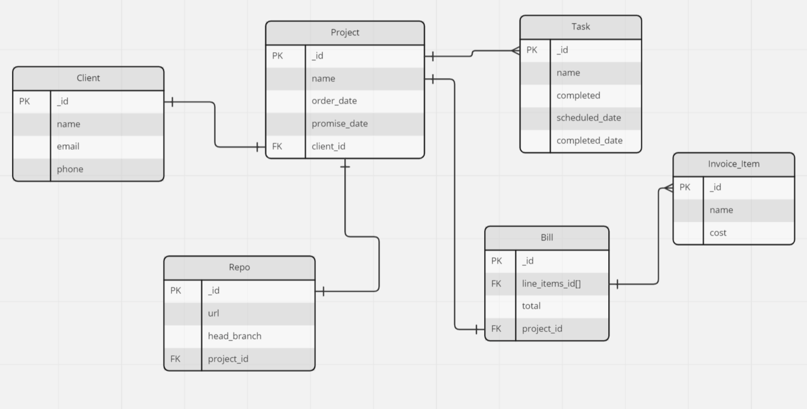

# BACK-END PROJECT (project-2) FOR PER SCHOLAS SOFTWARE ENGINEERING COHORT 25

## Mongoose/Express, Five models, full CRUD functionality for all 5, with relationships
### Assigned topic: A Business Model

--------------------

## A Software Services Provider

> The gist is that this is a company which develops software for clientéle.  
> This is a rudimentary demo of modeling the clients, projects, tasks, and billing.   
> It is not so much an attempt at a prototype for a product as it is an early study in the workings of document database models and relationships, the workings of Mongoose, and the construction of reusable dynamic components for data display.

### entity-relationship diagram (ERD)


#### an example of the type of flexible component structure I began with:
```
        <form action="" className="auto-form">
          {Object.entries(document).map(([docKey, docVal], index) => {
            return (
              <div className="form-field" key={`field-${index}`}>
                {
                  renderFormInput(docKey, docVal)
                }
              </div>
            )
          })}
        </form>
```

The following method renders an appropriate input type based on the typeof the current rendering document field value. Another considered possibility is to format the submitted json at the server, formatting each field into an object with meta-props such as renderAs and type, but unless I can discover a way to hold that information in the schema (and not on each document), without manually updating each and every field, it still comes down to checking the typeof. This is an area where I am looking to improve. E.g., I can detect if a field is an Object, but will `(obj instanceof Date)`, for example, work consistently?

```
  const renderFormInput = (docKey, docVal) => {
    switch (typeof (docVal)) {
      case "string":
        return (
          <>
            <label className="form-input-label" htmlFor={`form-input-${docKey}`}>{docKey}</label>
            <input id={`form-input-${docKey}`} type="text" className="form-text-input" name={docKey} defaultValue={docVal} />
          </>
        )
      case "boolean":
        return (
          <>
            <label className="form-input-label" htmlFor={`form-input-${docKey}`}>{docKey}</label>
            <input id={`form-input-${docKey}`} type="checkbox" className="form-checkbox-input" name={docKey} defaultChecked={docVal} />
          </>
        )
    }
    ... etc.
```